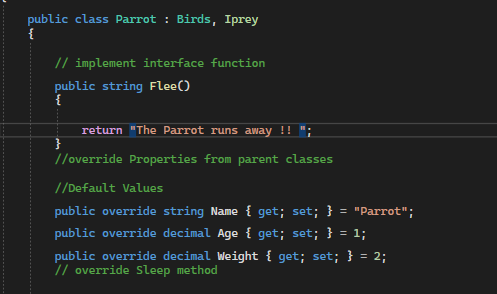
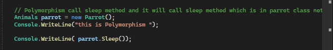
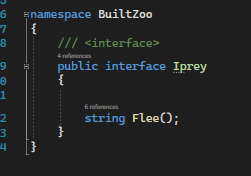
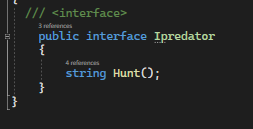
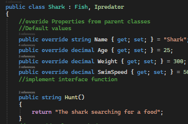

# BUILT ZOO
This is a console applocation that simulates a zoo using classes and Object-Oriented Programming (OOP)

A zoo contains animals, and animals come in many different shapes and sizes. this project provide an implementation on oop principles(inheritance,abstraction,polymorphism,encapsulation) , and provide implementation on interfaces
 ## Visual
 
 

 ### Inheretance :
 
  
  
## Polymorphism

  

**An interface is a completely "abstract class", which can only contain abstract methods and properties (with empty bodies)**
**POLYMORPHISM : This states that inherited properties and methods can (in certain cases) be altered (or overridden) once they by the class that derives them.**

**ENCAPSULATION**
This states that content of all types is both grouped (logically, and per the coder's discretion) and access to that group is controlled as:

Public - any group (class) can access it (all custom classes in this application are public)
Private - access is limited to inside the group (class) for which 'private' is specified (not used in this application)
protected - access is limited to inside the group (class) and any derivatives of it (not used in this application)

---

In My Project i have 2 interfaces : Ipredator and Iprey 

**interface implementation**

### How do you run the program?
- Clone repo to your device.
- Open the solution file Zoo.sln in Visual Studio.
- To run the app, go to Debug > Start Without Debugging (or press ctrl+F5).

 
