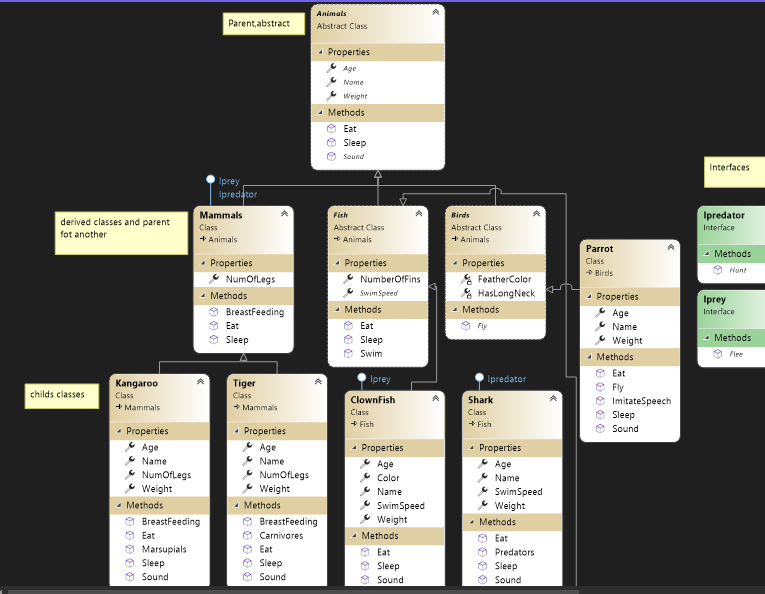

# BUILT ZOO
This is a console applocation that simulates a zoo using classes and Object-Oriented Programming (OOP)

A zoo contains animals, and animals come in many different shapes and sizes. this project provide an implementation on oop principles(inheritance,abstraction,polymorphism,encapsulation) , and provide implementation on interfaces
 ## Visual
 
